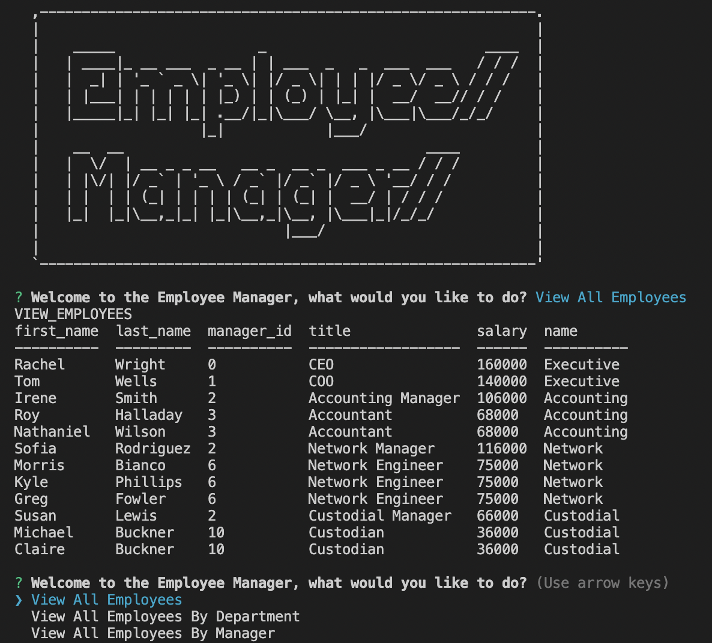
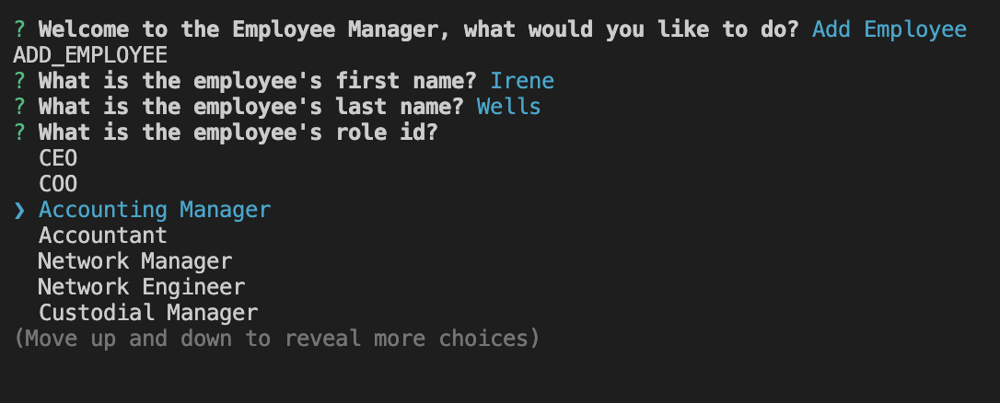

# The Employee Manager Project

## Table of Contents
            
- [Description](#Description)
- [Usage](#Usage)
- [Questions](#Questions)

### Description
For this project, I was tasked to create an application that will allow the user to manage their employees. To do this I used a series of inquirer questions that would act as a menu. Depending on what the user chooses they can view all of their employees, roles, and departments or view their employees by their manager or department. 

They can also choose to make changes to their employees such as adding employees, roles, and departments, deleting employees, roles, and departments, or updating employee's roles or managers. If the user chooses one of these, they will
be prompted with some more questions to get the specifics about their request, such as which employee they want to delete or what the name and role of the employee they are adding.

### Usage
To use this application, you need to open the project in the terminal and run node index to start the prompts. You will be presented with a menu that will allow you to view employees, roles, and departments, add employees, roles, and departments, delete employees, roles, and departments, and update and view employees by their managers and departments. 

This video will show a step-by-step guide to how this is done: <a href="https://www.awesomescreenshot.com/video/4193633?key=2b0d1fc817532f487f8f6830805be754">Video Guide</a>

### Questions
My Github: https://github.com/morrisbianco

andrewbianco98@gmail.com: Please contact me through this E-mail address with any further questions that you may have.